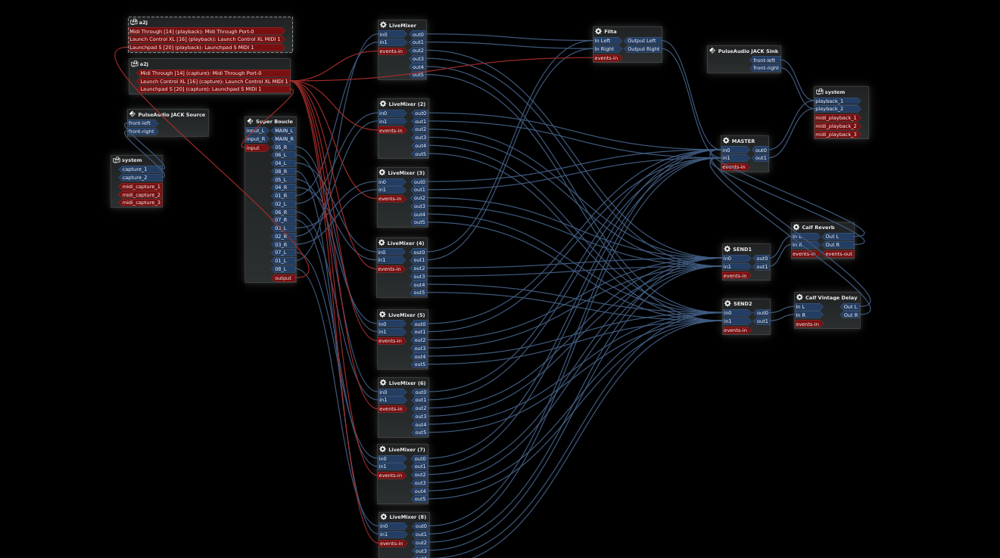

# LiveMixer

Stereo mixer strip with two aux sends (post fader)

Useful if you want to use [Carla] / [Patchage] as live mixing software with
MIDI binding.

## Usage

Every Plugin instance has 2 inputs (stereo) and 6 outputs.

- The first two outs are just stereo through (via fader).
- Outputs 3 and 4 are Send A (L and R)
- Outputs 5 and 6 are Send B (L and R)

## Screenshot

8 instances of LiveMixer used in Carla.

## Building

Use the Faust Online IDE to compile it as standalone program or audio plugin:

https://faustide.grame.fr/

Or use the `faust2lv2` or `faust2ladspa` programs.

## License

Published under the GNU General Public License Version 2. See the file
[LICENSE](./LICENSE) for details.

[Carla]: https://kx.studio/Applications:Carla
[Patchage]: https://drobilla.net/software/patchage
